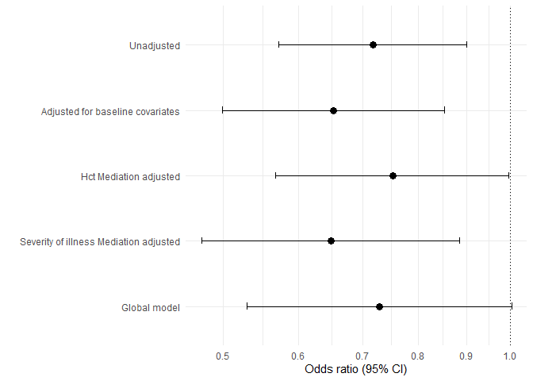
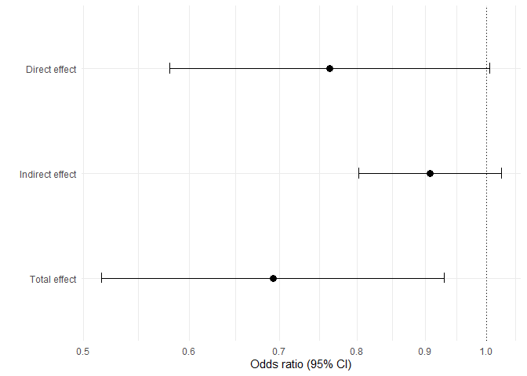

Markdown title
================
IPD-PMA team
2024-11-20

# Checking associations

### Between treatment and mediators

<table class="gt_table" data-quarto-disable-processing="false" data-quarto-bootstrap="false">
  <thead>
    &#10;    <tr class="gt_col_headings">
      <th class="gt_col_heading gt_columns_bottom_border gt_left" rowspan="1" colspan="1" scope="col" id="&lt;strong&gt;Characteristic&lt;/strong&gt;"><strong>Characteristic</strong></th>
      <th class="gt_col_heading gt_columns_bottom_border gt_center" rowspan="1" colspan="1" scope="col" id="&lt;strong&gt;OR&lt;/strong&gt;&lt;span class=&quot;gt_footnote_marks&quot; style=&quot;white-space:nowrap;font-style:italic;font-weight:normal;&quot;&gt;&lt;sup&gt;1&lt;/sup&gt;&lt;/span&gt;"><strong>OR</strong>1</th>
      <th class="gt_col_heading gt_columns_bottom_border gt_center" rowspan="1" colspan="1" scope="col" id="&lt;strong&gt;95% CI&lt;/strong&gt;&lt;span class=&quot;gt_footnote_marks&quot; style=&quot;white-space:nowrap;font-style:italic;font-weight:normal;&quot;&gt;&lt;sup&gt;1&lt;/sup&gt;&lt;/span&gt;"><strong>95% CI</strong>1</th>
      <th class="gt_col_heading gt_columns_bottom_border gt_center" rowspan="1" colspan="1" scope="col" id="&lt;strong&gt;p-value&lt;/strong&gt;"><strong>p-value</strong></th>
    </tr>
  </thead>
  <tbody class="gt_table_body">
    <tr><td headers="label" class="gt_row gt_left">hct_week1_peak</td>
<td headers="estimate" class="gt_row gt_center">1.03</td>
<td headers="ci" class="gt_row gt_center">1.02, 1.05</td>
<td headers="p.value" class="gt_row gt_center"><0.001</td></tr>
    <tr><td headers="label" class="gt_row gt_left">cumalitive_blood_vol_sampled_scaled</td>
<td headers="estimate" class="gt_row gt_center">1.00</td>
<td headers="ci" class="gt_row gt_center">1.00, 1.01</td>
<td headers="p.value" class="gt_row gt_center">0.9</td></tr>
    <tr><td headers="label" class="gt_row gt_left">arterial_lines</td>
<td headers="estimate" class="gt_row gt_center">1.42</td>
<td headers="ci" class="gt_row gt_center">1.08, 1.88</td>
<td headers="p.value" class="gt_row gt_center">0.013</td></tr>
    <tr><td headers="label" class="gt_row gt_left">mech_vent_combined</td>
<td headers="estimate" class="gt_row gt_center"> </td>
<td headers="ci" class="gt_row gt_center"> </td>
<td headers="p.value" class="gt_row gt_center"> </td></tr>
    <tr><td headers="label" class="gt_row gt_left">    0</td>
<td headers="estimate" class="gt_row gt_center">—</td>
<td headers="ci" class="gt_row gt_center">—</td>
<td headers="p.value" class="gt_row gt_center"> </td></tr>
    <tr><td headers="label" class="gt_row gt_left">    1</td>
<td headers="estimate" class="gt_row gt_center">1.13</td>
<td headers="ci" class="gt_row gt_center">0.78, 1.66</td>
<td headers="p.value" class="gt_row gt_center">0.5</td></tr>
  </tbody>
  &#10;  <tfoot class="gt_footnotes">
    <tr>
      <td class="gt_footnote" colspan="4">1 OR = Odds Ratio, CI = Confidence Interval</td>
    </tr>
  </tfoot>
</table>

### global models for outcome any blood transfusion

<table class="gt_table" data-quarto-disable-processing="false" data-quarto-bootstrap="false">
  <thead>
    &#10;    <tr class="gt_col_headings">
      <th class="gt_col_heading gt_columns_bottom_border gt_left" rowspan="1" colspan="1" scope="col" id="&lt;strong&gt;Characteristic&lt;/strong&gt;"><strong>Characteristic</strong></th>
      <th class="gt_col_heading gt_columns_bottom_border gt_center" rowspan="1" colspan="1" scope="col" id="&lt;strong&gt;OR&lt;/strong&gt;&lt;span class=&quot;gt_footnote_marks&quot; style=&quot;white-space:nowrap;font-style:italic;font-weight:normal;&quot;&gt;&lt;sup&gt;1&lt;/sup&gt;&lt;/span&gt;"><strong>OR</strong>1</th>
      <th class="gt_col_heading gt_columns_bottom_border gt_center" rowspan="1" colspan="1" scope="col" id="&lt;strong&gt;95% CI&lt;/strong&gt;&lt;span class=&quot;gt_footnote_marks&quot; style=&quot;white-space:nowrap;font-style:italic;font-weight:normal;&quot;&gt;&lt;sup&gt;1&lt;/sup&gt;&lt;/span&gt;"><strong>95% CI</strong>1</th>
      <th class="gt_col_heading gt_columns_bottom_border gt_center" rowspan="1" colspan="1" scope="col" id="&lt;strong&gt;p-value&lt;/strong&gt;"><strong>p-value</strong></th>
    </tr>
  </thead>
  <tbody class="gt_table_body">
    <tr><td headers="label" class="gt_row gt_left">treatment_cat1</td>
<td headers="estimate" class="gt_row gt_center"> </td>
<td headers="ci" class="gt_row gt_center"> </td>
<td headers="p.value" class="gt_row gt_center"> </td></tr>
    <tr><td headers="label" class="gt_row gt_left">    0</td>
<td headers="estimate" class="gt_row gt_center">—</td>
<td headers="ci" class="gt_row gt_center">—</td>
<td headers="p.value" class="gt_row gt_center"> </td></tr>
    <tr><td headers="label" class="gt_row gt_left">    1</td>
<td headers="estimate" class="gt_row gt_center">0.73</td>
<td headers="ci" class="gt_row gt_center">0.53, 1.00</td>
<td headers="p.value" class="gt_row gt_center">0.053</td></tr>
    <tr><td headers="label" class="gt_row gt_left">hct_week1_peak</td>
<td headers="estimate" class="gt_row gt_center">0.94</td>
<td headers="ci" class="gt_row gt_center">0.92, 0.96</td>
<td headers="p.value" class="gt_row gt_center"><0.001</td></tr>
    <tr><td headers="label" class="gt_row gt_left">cumalitive_blood_vol_sampled_scaled</td>
<td headers="estimate" class="gt_row gt_center">1.07</td>
<td headers="ci" class="gt_row gt_center">1.05, 1.08</td>
<td headers="p.value" class="gt_row gt_center"><0.001</td></tr>
    <tr><td headers="label" class="gt_row gt_left">arterial_lines</td>
<td headers="estimate" class="gt_row gt_center">1.16</td>
<td headers="ci" class="gt_row gt_center">0.83, 1.64</td>
<td headers="p.value" class="gt_row gt_center">0.4</td></tr>
    <tr><td headers="label" class="gt_row gt_left">mech_vent_combined</td>
<td headers="estimate" class="gt_row gt_center"> </td>
<td headers="ci" class="gt_row gt_center"> </td>
<td headers="p.value" class="gt_row gt_center"> </td></tr>
    <tr><td headers="label" class="gt_row gt_left">    0</td>
<td headers="estimate" class="gt_row gt_center">—</td>
<td headers="ci" class="gt_row gt_center">—</td>
<td headers="p.value" class="gt_row gt_center"> </td></tr>
    <tr><td headers="label" class="gt_row gt_left">    1</td>
<td headers="estimate" class="gt_row gt_center">1.76</td>
<td headers="ci" class="gt_row gt_center">1.04, 3.05</td>
<td headers="p.value" class="gt_row gt_center">0.040</td></tr>
    <tr><td headers="label" class="gt_row gt_left">GA_weeks_and_days_integer</td>
<td headers="estimate" class="gt_row gt_center">0.93</td>
<td headers="ci" class="gt_row gt_center">0.92, 0.94</td>
<td headers="p.value" class="gt_row gt_center"><0.001</td></tr>
    <tr><td headers="label" class="gt_row gt_left">multiple</td>
<td headers="estimate" class="gt_row gt_center"> </td>
<td headers="ci" class="gt_row gt_center"> </td>
<td headers="p.value" class="gt_row gt_center"> </td></tr>
    <tr><td headers="label" class="gt_row gt_left">    0</td>
<td headers="estimate" class="gt_row gt_center">—</td>
<td headers="ci" class="gt_row gt_center">—</td>
<td headers="p.value" class="gt_row gt_center"> </td></tr>
    <tr><td headers="label" class="gt_row gt_left">    1</td>
<td headers="estimate" class="gt_row gt_center">1.41</td>
<td headers="ci" class="gt_row gt_center">0.99, 2.03</td>
<td headers="p.value" class="gt_row gt_center">0.058</td></tr>
  </tbody>
  &#10;  <tfoot class="gt_footnotes">
    <tr>
      <td class="gt_footnote" colspan="4">1 OR = Odds Ratio, CI = Confidence Interval</td>
    </tr>
  </tfoot>
</table>

# Medflex (sequential approach)

<https://academic.oup.com/ije/article/47/3/829/4829681?login=true>

kristy paper
<https://academic.oup.com/ejendo/article/189/1/50/7219871?login=true>
<https://github.com/kristyrobledo/T4DM_mediation_paper>

instruction paper
<https://bmcmedresmethodol.biomedcentral.com/articles/10.1186/s12874-022-01764-w>

(sup materials)
<https://static-content.springer.com/esm/art%3A10.1186%2Fs12874-022-01764-w/MediaObjects/12874_2022_1764_MOESM1_ESM.pdf>

## Outcome: transufsion any (y/n)

### Mediation of Hct peak (M1 only)

    ##            Effect  Estimate  95%_CI_L  95%_CI_U
    ## 1   Direct effect 0.7646152 0.5842532 1.0006559
    ## 2 Indirect effect 0.8535287 0.7870670 0.9256026
    ## 3    Total effect 0.6526210 0.4973579 0.8563536

    ## [1] "Proportion mediated: 37.1%"

## Joint model including both Hct (M1) and Severity of illness (M2)

    ##            Effect  Estimate  95%_CI_L  95%_CI_U
    ## 1   Direct effect 0.7636927 0.5800280 1.0055144
    ## 2 Indirect effect 0.9072675 0.8029812 1.0250978
    ## 3    Total effect 0.6928736 0.5162991 0.9298366

    ## [1] "Proportion mediated: 26.5%"

# Table of results

    ##                         id          Effect    est_for_table
    ## 1 M1 only: transfusion_any   Direct effect    0.76 (0.58-1)
    ## 2 M1 only: transfusion_any Indirect effect 0.85 (0.79-0.93)
    ## 3 M1 only: transfusion_any    Total effect  0.65 (0.5-0.86)
    ##                                  id          Effect    est_for_table
    ## 1 M1M2 joint model: transfusion_any   Direct effect 0.76 (0.58-1.01)
    ## 2 M1M2 joint model: transfusion_any Indirect effect  0.91 (0.8-1.03)
    ## 3 M1M2 joint model: transfusion_any    Total effect 0.69 (0.52-0.93)
