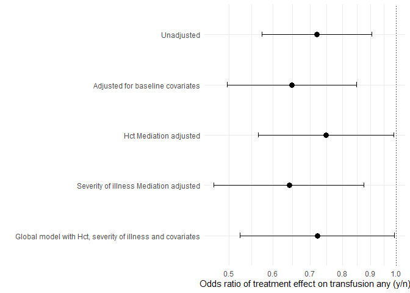
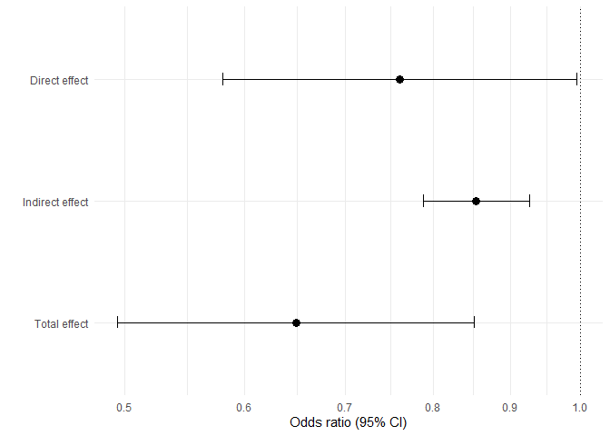

Medflex
================
Sol Libesman

    #> 
    #> 
    #> processing file: Analysis_medflex_for_Git2.md

    #>   |                                                                              |                                                                      |   0%  |                                                                              |......................................................................| 100%

    #> output file: TITANS_medlfex.md

    #> [1] "TITANS_medlfex.md"

# Checking associations

### Between treatment and mediators

``` r
treatmentmodel <- glm(treatment_cat1  ~ hct_week1_peak+cumalitive_blood_vol_sampled_scaled +arterial_lines+mech_vent_combined,  family =  binomial("logit"), data = final_df)

model <- treatmentmodel %>% tbl_regression(exponentiate = TRUE)
```

### global model

examining the relationship between treatment and transfusions (any)
adjusting for all covariates

``` r
adjustedfullmodel <- glm(rc_transfusion_titans ~ treatment_cat1+ hct_week1_peak+cumalitive_blood_vol_sampled_scaled +arterial_lines+mech_vent_combined +GA_weeks_and_days_integer + multiple,  family =  binomial("logit"), data = final_df)


model <- adjustedfullmodel %>% tbl_regression(exponentiate = TRUE)
```

``` r
unadjustedmodel <- glm(rc_transfusion_titans ~ treatment_cat1,  family =  binomial("logit"), data = final_df) %>%
  tbl_regression(exponentiate = TRUE,
                 show_single_row="treatment_cat1",
                 include = c("treatment_cat1"))
```

``` r
adjusted_basedlinedmodel <- glm(rc_transfusion_titans ~ treatment_cat1+GA_weeks_and_days_integer + multiple,  family =  binomial("logit"), data = final_df)%>%  
  tbl_regression(exponentiate = TRUE,
                 show_single_row="treatment_cat1",
                 include = c("treatment_cat1"))
```

``` r
adjusted_hct_mediator_model <- glm(rc_transfusion_titans ~ treatment_cat1+ hct_week1_peak +GA_weeks_and_days_integer + multiple,  family =  binomial("logit"), data = final_df) %>%   
  tbl_regression(exponentiate = TRUE,
                 show_single_row="treatment_cat1",
                 include = c("treatment_cat1"))
```

``` r
adjusted_severity_of_illness_mediator_model <- glm(rc_transfusion_titans ~ treatment_cat1+ cumalitive_blood_vol_sampled_scaled +arterial_lines+mech_vent_combined +GA_weeks_and_days_integer + multiple,  family =  binomial("logit"), data = final_df) %>%   tbl_regression(exponentiate = TRUE,
                 show_single_row="treatment_cat1",
                 include = c("treatment_cat1"))
```

``` r
adjustedfullmodel <- glm(rc_transfusion_titans ~ treatment_cat1+ hct_week1_peak+cumalitive_blood_vol_sampled_scaled +arterial_lines+mech_vent_combined +GA_weeks_and_days_integer + multiple,  family =  binomial("logit"), data = final_df) %>%   tbl_regression(exponentiate = TRUE,
                 show_single_row="treatment_cat1",
                 include = c("treatment_cat1"))
```

``` r
models.a<-tbl_stack(list(unadjustedmodel, 
                         adjusted_basedlinedmodel, 
                         adjusted_hct_mediator_model,
                         adjusted_severity_of_illness_mediator_model,
                         adjustedfullmodel))

models.a$table_body %>%
  mutate(name = case_when(tbl_id1==1 ~ "Unadjusted", 
                          tbl_id1==2 ~ "Adjusted for baseline covariates" , 
                          tbl_id1==3 ~ "Hct Mediation adjusted",
                          tbl_id1==4 ~ "Severity of illness Mediation adjusted",
                          tbl_id1==5 ~ "Global model",) %>%
           as.factor()) %>%
  ggplot(aes(y=fct_reorder(name, -tbl_id1), x=estimate)) +
  geom_point(size=3)+
  geom_errorbar(aes(xmax=conf.high, xmin=conf.low), size=0.5, width=0.1) +
  labs(x="Odds ratio (95% CI)", y="")+
  geom_vline(aes(xintercept= 1), linetype="dotted")+
  coord_trans(x = scales:::log_trans(base = exp(1))) +
  theme_minimal() -> plot.a

plot.a
```



# Medflex (sequential approach)

<https://academic.oup.com/ije/article/47/3/829/4829681?login=true>

kristy paper
<https://academic.oup.com/ejendo/article/189/1/50/7219871?login=true>
<https://github.com/kristyrobledo/T4DM_mediation_paper>

instruction paper
<https://bmcmedresmethodol.biomedcentral.com/articles/10.1186/s12874-022-01764-w>

(sup materials)
<https://static-content.springer.com/esm/art%3A10.1186%2Fs12874-022-01764-w/MediaObjects/12874_2022_1764_MOESM1_ESM.pdf>

## Outcome: transufsion any (y/n)

### Mediation of Hct peak (M1 only)

``` r
final_df1 <- final_df %>% filter(!is.na(rc_transfusion_titans) &
                                  !is.na(hct_week1_peak)&
                                   !is.na(GA_weeks_and_days_integer)&
                                  !is.na(multiple))


impData <- medflex::neImpute(rc_transfusion_titans ~ factor(treatment_cat1) +
                     hct_week1_peak +
                    GA_weeks_and_days_integer +
                    multiple,
                    family = binomial("logit"), nMed = 1, data = final_df1)


#head(impData)
neMod.extra.cont <- medflex::neModel(rc_transfusion_titans ~ treatment_cat10+
                              treatment_cat11 +
                    GA_weeks_and_days_integer +
                    multiple,
                  family = binomial("logit"),
                  expData = impData,
                  se = "robust")


#summary(neMod.extra.cont)

cont.extra<-data.frame(est = neMod.extra.cont$neModelFit$coefficients, confint(neMod.extra.cont))

lht <- medflex::neLht(neMod.extra.cont, linfct = c("treatment_cat101 = 0", 
                                          "treatment_cat111  = 0", 
                                          "treatment_cat101 + treatment_cat111  = 0"))

t<-summary(lht)

cat.extra<-data.frame(est = exp(t$coefficients[,1]), exp(confint(lht)))

#t


#pte.direct.cat<-(t$coefficients[1,1]/t$coefficients[3,1])*100
pte.indirect.cat<-(t$coefficients[2,1]/t$coefficients[3,1])*100
#pte.indirect.cat


cat.extra %>%
  mutate(name = c("Direct effect", "Indirect effect", "Total effect")) %>%
  ggplot(aes(y=fct_rev(name), x=est)) +
  geom_point(size=3)+
  geom_errorbar(aes(xmax=X95..UCL, xmin=X95..LCL), size=0.5, width=0.1) +
  labs(x="Odds ratio (95% CI)", y="")+
  geom_vline(aes(xintercept= 1), linetype="dotted")+
  coord_trans(x = scales:::log_trans(base = exp(1))) +
  theme_minimal() -> plot.a2

plot.a2
```



``` r
#Formulat for table
cat.extra <- cat.extra %>%
  mutate(Effect = c("Direct effect", "Indirect effect", "Total effect")) %>% relocate(Effect) %>% dplyr::rename(
    "Estimate"= est,
    "95%_CI_L"= `X95..LCL`,
   "95%_CI_U"= `X95..UCL`,)
row.names(cat.extra) <- NULL


M1.model_transfusion_any <- cat.extra


M1.model_transfusion_any #%>% kable() %>% kable_styling()
```

    #>            Effect  Estimate  95%_CI_L  95%_CI_U
    #> 1   Direct effect 0.7646152 0.5842532 1.0006559
    #> 2 Indirect effect 0.8535287 0.7870670 0.9256026
    #> 3    Total effect 0.6526210 0.4973579 0.8563536

``` r
prop_mediated_M1.model_trans_any <-  round((t$coef[3]/(t$coef[2]+t$coef[3])*100),1)
```

``` r
print(paste0("Proportion mediated: ",prop_mediated_M1.model_trans_any , "%"))
```

    #> [1] "Proportion mediated: 37.1%"

## Joint model including both Hct (M1) and Severity of illness (M2)

``` r
final_df1 <- final_df %>% filter(!is.na(hct_week1_peak)&
                                  !is.na(cumalitive_blood_vol_sampled)&
                                  !is.na(arterial_lines)&
                                  !is.na(mech_vent_combined)&
                                  !is.na(GA_weeks_and_days_integer)&
                                  !is.na(multiple))


#==========================================================================================================
impData <- medflex::neImpute(rc_transfusion_titans ~ factor(treatment_cat1) +
                     hct_week1_peak +cumalitive_blood_vol_sampled +  arterial_lines+ mech_vent_combined +
                    GA_weeks_and_days_integer +
                    multiple,
                    family = binomial("logit"), nMed = 4, data = final_df1)


#head(impData)
neMod.extra.cont <- medflex::neModel(rc_transfusion_titans ~ treatment_cat10+
                              treatment_cat11+
                    GA_weeks_and_days_integer +
                    multiple,
                  family = binomial("logit"),
                  expData = impData,
                  se = "robust")


#summary(neMod.extra.cont)

cont.extra<-data.frame(est = neMod.extra.cont$neModelFit$coefficients, confint(neMod.extra.cont))

lht <- medflex::neLht(neMod.extra.cont, linfct = c("treatment_cat101 = 0", 
                                          "treatment_cat111  = 0", 
                                          "treatment_cat101 + treatment_cat111  = 0"))

t<-summary(lht)

cat.extra<-data.frame(est = exp(t$coefficients[,1]), exp(confint(lht)))

#t


#pte.direct.cat<-(t$coefficients[1,1]/t$coefficients[3,1])*100
pte.indirect.cat<-(t$coefficients[2,1]/t$coefficients[3,1])*100
#pte.indirect.cat


cat.extra %>%
  mutate(name = c("Direct effect", "Indirect effect", "Total effect")) %>%
  ggplot(aes(y=fct_rev(name), x=est)) +
  geom_point(size=3)+
  geom_errorbar(aes(xmax=X95..UCL, xmin=X95..LCL), size=0.5, width=0.1) +
  labs(x="Odds ratio (95% CI)", y="")+
  geom_vline(aes(xintercept= 1), linetype="dotted")+
  coord_trans(x = scales:::log_trans(base = exp(1))) +
  theme_minimal() -> plot.a2

plot.a2
```


``` r
#code to table results
cat.extra <- cat.extra %>%
  mutate(Effect = c("Direct effect", "Indirect effect", "Total effect")) %>% relocate(Effect) %>% dplyr::rename(
    "Estimate"= est,
    "95%_CI_L"= `X95..LCL`,
   "95%_CI_U"= `X95..UCL`)
row.names(cat.extra) <- NULL

#cat.extra


joint.M1M2.model_transfusion_any <- cat.extra
joint.M1M2.model_transfusion_any# %>% kable() %>% kable_styling()
```

    #>            Effect  Estimate  95%_CI_L  95%_CI_U
    #> 1   Direct effect 0.7636927 0.5800280 1.0055144
    #> 2 Indirect effect 0.9072675 0.8029812 1.0250978
    #> 3    Total effect 0.6928736 0.5162991 0.9298366

``` r
prop_mediated_joint_model_trans_any <-  round((t$coef[3]/(t$coef[2]+t$coef[3])*100),1)
```

``` r
paste0("Proportion mediated: ",prop_mediated_joint_model_trans_any, "%")
```

    #> [1] "Proportion mediated: 26.5%"

# Table of results

``` r
M1_model_results <- bind_rows(list("M1 only: transfusion_any"=M1.model_transfusion_any), .id="id")
M1_model_results <- M1_model_results %>% mutate(across(c(Estimate, `95%_CI_L`, `95%_CI_U`), round, digits=2) )
```

    #> Warning: There was 1 warning in `mutate()`.
    #> ℹ In argument: `across(c(Estimate, `95%_CI_L`, `95%_CI_U`), round, digits =
    #>   2)`.
    #> Caused by warning:
    #> ! The `...` argument of `across()` is deprecated as of dplyr 1.1.0.
    #> Supply arguments directly to `.fns` through an anonymous function instead.
    #> 
    #>   # Previously
    #>   across(a:b, mean, na.rm = TRUE)
    #> 
    #>   # Now
    #>   across(a:b, \(x) mean(x, na.rm = TRUE))

``` r
M1_model_results$est_for_table <- paste0(M1_model_results$Estimate, " (", M1_model_results$`95%_CI_L`,"-", M1_model_results$`95%_CI_U`,")")

M1_model_results <- M1_model_results %>% select(id, Effect, est_for_table)


M1M2_joint_model_results <- bind_rows(list("M1M2 joint model: transfusion_any"=joint.M1M2.model_transfusion_any), .id="id")
M1M2_joint_model_results <- M1M2_joint_model_results %>% mutate(across(c(Estimate, `95%_CI_L`, `95%_CI_U`), round, digits=2) )
M1M2_joint_model_results$est_for_table <- paste0(M1M2_joint_model_results$Estimate, " (", M1M2_joint_model_results$`95%_CI_L`,"-", M1M2_joint_model_results$`95%_CI_U`,")")
M1M2_joint_model_results <- M1M2_joint_model_results %>% select(id, Effect, est_for_table)


combined_mediation_results <- cbind(M1_model_results, M1M2_joint_model_results)


combined_mediation_results 
```

    #>                         id          Effect    est_for_table
    #> 1 M1 only: transfusion_any   Direct effect    0.76 (0.58-1)
    #> 2 M1 only: transfusion_any Indirect effect 0.85 (0.79-0.93)
    #> 3 M1 only: transfusion_any    Total effect  0.65 (0.5-0.86)
    #>                                  id          Effect    est_for_table
    #> 1 M1M2 joint model: transfusion_any   Direct effect 0.76 (0.58-1.01)
    #> 2 M1M2 joint model: transfusion_any Indirect effect  0.91 (0.8-1.03)
    #> 3 M1M2 joint model: transfusion_any    Total effect 0.69 (0.52-0.93)
