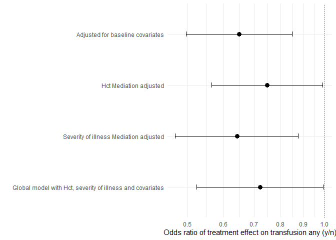

Medflex
================
Sol Libesman

# Checking associations

### Between treatment and mediators

``` r
treatmentmodel <- glm(treatment_cat1  ~ hct_week1_peak+cumalitive_blood_vol_sampled_scaled +arterial_lines+mech_vent_combined,  family =  binomial("logit"), data = final_df)

 glm(treatment_cat1  ~ hct_week1_peak+cumalitive_blood_vol_sampled_scaled +arterial_lines+mech_vent_combined,  family =  binomial("logit"), data = final_df) %>% tbl_regression(exponentiate = TRUE) %>% kable()
```

<table>
<thead>
<tr>
<th style="text-align:left;">
**Characteristic**
</th>
<th style="text-align:left;">
**OR**
</th>
<th style="text-align:left;">
**95% CI**
</th>
<th style="text-align:left;">
**p-value**
</th>
</tr>
</thead>
<tbody>
<tr>
<td style="text-align:left;">
hct_week1_peak
</td>
<td style="text-align:left;">
1.03
</td>
<td style="text-align:left;">
1.02, 1.05
</td>
<td style="text-align:left;">
\<0.001
</td>
</tr>
<tr>
<td style="text-align:left;">
cumalitive_blood_vol_sampled_scaled
</td>
<td style="text-align:left;">
1.00
</td>
<td style="text-align:left;">
1.00, 1.01
</td>
<td style="text-align:left;">
0.9
</td>
</tr>
<tr>
<td style="text-align:left;">
arterial_lines
</td>
<td style="text-align:left;">
1.42
</td>
<td style="text-align:left;">
1.08, 1.88
</td>
<td style="text-align:left;">
0.013
</td>
</tr>
<tr>
<td style="text-align:left;">
mech_vent_combined
</td>
<td style="text-align:left;">
NA
</td>
<td style="text-align:left;">
NA
</td>
<td style="text-align:left;">
NA
</td>
</tr>
<tr>
<td style="text-align:left;">
0
</td>
<td style="text-align:left;">
NA
</td>
<td style="text-align:left;">
NA
</td>
<td style="text-align:left;">
NA
</td>
</tr>
<tr>
<td style="text-align:left;">
1
</td>
<td style="text-align:left;">
1.13
</td>
<td style="text-align:left;">
0.78, 1.66
</td>
<td style="text-align:left;">
0.5
</td>
</tr>
</tbody>
</table>

### global model

examining the relationship between treatment and transfusions (any)
adjusting for all covariates

``` r
adjustedfullmodel <- glm(rc_transfusion_titans ~ treatment_cat1+ hct_week1_peak+cumalitive_blood_vol_sampled_scaled +arterial_lines+mech_vent_combined +GA_weeks_and_days_integer + multiple,  family =  binomial("logit"), data = final_df)


glm(rc_transfusion_titans ~ treatment_cat1+ hct_week1_peak+cumalitive_blood_vol_sampled_scaled +arterial_lines+mech_vent_combined +GA_weeks_and_days_integer + multiple,  family =  binomial("logit"), data = final_df) %>% tbl_regression(exponentiate = TRUE) %>% kable()
```

<table>
<thead>
<tr>
<th style="text-align:left;">
**Characteristic**
</th>
<th style="text-align:left;">
**OR**
</th>
<th style="text-align:left;">
**95% CI**
</th>
<th style="text-align:left;">
**p-value**
</th>
</tr>
</thead>
<tbody>
<tr>
<td style="text-align:left;">
treatment_cat1
</td>
<td style="text-align:left;">
NA
</td>
<td style="text-align:left;">
NA
</td>
<td style="text-align:left;">
NA
</td>
</tr>
<tr>
<td style="text-align:left;">
0
</td>
<td style="text-align:left;">
NA
</td>
<td style="text-align:left;">
NA
</td>
<td style="text-align:left;">
NA
</td>
</tr>
<tr>
<td style="text-align:left;">
1
</td>
<td style="text-align:left;">
0.73
</td>
<td style="text-align:left;">
0.53, 1.00
</td>
<td style="text-align:left;">
0.053
</td>
</tr>
<tr>
<td style="text-align:left;">
hct_week1_peak
</td>
<td style="text-align:left;">
0.94
</td>
<td style="text-align:left;">
0.92, 0.96
</td>
<td style="text-align:left;">
\<0.001
</td>
</tr>
<tr>
<td style="text-align:left;">
cumalitive_blood_vol_sampled_scaled
</td>
<td style="text-align:left;">
1.07
</td>
<td style="text-align:left;">
1.05, 1.08
</td>
<td style="text-align:left;">
\<0.001
</td>
</tr>
<tr>
<td style="text-align:left;">
arterial_lines
</td>
<td style="text-align:left;">
1.16
</td>
<td style="text-align:left;">
0.83, 1.64
</td>
<td style="text-align:left;">
0.4
</td>
</tr>
<tr>
<td style="text-align:left;">
mech_vent_combined
</td>
<td style="text-align:left;">
NA
</td>
<td style="text-align:left;">
NA
</td>
<td style="text-align:left;">
NA
</td>
</tr>
<tr>
<td style="text-align:left;">
0
</td>
<td style="text-align:left;">
NA
</td>
<td style="text-align:left;">
NA
</td>
<td style="text-align:left;">
NA
</td>
</tr>
<tr>
<td style="text-align:left;">
1
</td>
<td style="text-align:left;">
1.76
</td>
<td style="text-align:left;">
1.04, 3.05
</td>
<td style="text-align:left;">
0.040
</td>
</tr>
<tr>
<td style="text-align:left;">
GA_weeks_and_days_integer
</td>
<td style="text-align:left;">
0.93
</td>
<td style="text-align:left;">
0.92, 0.94
</td>
<td style="text-align:left;">
\<0.001
</td>
</tr>
<tr>
<td style="text-align:left;">
multiple
</td>
<td style="text-align:left;">
NA
</td>
<td style="text-align:left;">
NA
</td>
<td style="text-align:left;">
NA
</td>
</tr>
<tr>
<td style="text-align:left;">
0
</td>
<td style="text-align:left;">
NA
</td>
<td style="text-align:left;">
NA
</td>
<td style="text-align:left;">
NA
</td>
</tr>
<tr>
<td style="text-align:left;">
1
</td>
<td style="text-align:left;">
1.41
</td>
<td style="text-align:left;">
0.99, 2.03
</td>
<td style="text-align:left;">
0.058
</td>
</tr>
</tbody>
</table>

``` r
unadjustedmodel <- glm(rc_transfusion_titans ~ treatment_cat1,  family =  binomial("logit"), data = final_df) %>%
  tbl_regression(exponentiate = TRUE,
                 show_single_row="treatment_cat1",
                 include = c("treatment_cat1"))
```

``` r
adjusted_basedlinedmodel <- glm(rc_transfusion_titans ~ treatment_cat1+GA_weeks_and_days_integer + multiple,  family =  binomial("logit"), data = final_df)%>%  
  tbl_regression(exponentiate = TRUE,
                 show_single_row="treatment_cat1",
                 include = c("treatment_cat1"))
```

``` r
adjusted_hct_mediator_model <- glm(rc_transfusion_titans ~ treatment_cat1+ hct_week1_peak +GA_weeks_and_days_integer + multiple,  family =  binomial("logit"), data = final_df) %>%   
  tbl_regression(exponentiate = TRUE,
                 show_single_row="treatment_cat1",
                 include = c("treatment_cat1"))
```

``` r
adjusted_severity_of_illness_mediator_model <- glm(rc_transfusion_titans ~ treatment_cat1+ cumalitive_blood_vol_sampled_scaled +arterial_lines+mech_vent_combined +GA_weeks_and_days_integer + multiple,  family =  binomial("logit"), data = final_df) %>%   tbl_regression(exponentiate = TRUE,
                 show_single_row="treatment_cat1",
                 include = c("treatment_cat1"))
```

``` r
adjustedfullmodel <- glm(rc_transfusion_titans ~ treatment_cat1+ hct_week1_peak+cumalitive_blood_vol_sampled_scaled +arterial_lines+mech_vent_combined +GA_weeks_and_days_integer + multiple,  family =  binomial("logit"), data = final_df) %>%   tbl_regression(exponentiate = TRUE,
                 show_single_row="treatment_cat1",
                 include = c("treatment_cat1"))
```

``` r
models.a<-tbl_stack(list(unadjustedmodel, 
                         adjusted_basedlinedmodel, 
                         adjusted_hct_mediator_model,
                         adjusted_severity_of_illness_mediator_model,
                         adjustedfullmodel))

models.a$table_body %>%
  mutate(name = case_when(tbl_id1==1 ~ "Unadjusted", 
                          tbl_id1==2 ~ "Adjusted for baseline covariates" , 
                          tbl_id1==3 ~ "Hct Mediation adjusted",
                          tbl_id1==4 ~ "Severity of illness Mediation adjusted",
                          tbl_id1==5 ~ "Global model with Hct, severity of illness and covariates",) %>%
           as.factor()) %>%
  ggplot(aes(y=fct_reorder(name, -tbl_id1), x=estimate)) +
  geom_point(size=3)+
  geom_errorbar(aes(xmax=conf.high, xmin=conf.low), size=0.5, width=0.1) +
  labs(x="Odds ratio of treatment effect on transfusion any (y/n)", y="")+
  geom_vline(aes(xintercept= 1), linetype="dotted")+
  coord_trans(x = scales:::log_trans(base = exp(1))) +
  theme_minimal() -> plot.a

plot.a
```



# Medflex (sequential approach)

Modeling approach informed by

kristy Robledo’s paper
<https://academic.oup.com/ejendo/article/189/1/50/7219871?login=true>
<https://github.com/kristyrobledo/T4DM_mediation_paper>

Zoe Aitken’s paper on sequential mediation
<https://academic.oup.com/ije/article/47/3/829/4829681?login=true>

and D Zugna’s instruction paper
<https://bmcmedresmethodol.biomedcentral.com/articles/10.1186/s12874-022-01764-w>
(sup materials)
<https://static-content.springer.com/esm/art%3A10.1186%2Fs12874-022-01764-w/MediaObjects/12874_2022_1764_MOESM1_ESM.pdf>

## Outcome: transufsion any (y/n)

### Mediation of Hct peak (M1 only)

First we examine whether Hct alone mediates the effect of intervention
of outcome

``` r
final_df1 <- final_df %>% filter(!is.na(rc_transfusion_titans) &
                                  !is.na(hct_week1_peak)&
                                   !is.na(GA_weeks_and_days_integer)&
                                  !is.na(multiple))


impData <- medflex::neImpute(rc_transfusion_titans ~ factor(treatment_cat1) +
                     hct_week1_peak +
                    GA_weeks_and_days_integer +
                    multiple,
                    family = binomial("logit"), nMed = 1, data = final_df1)


#head(impData)
neMod.extra.cont <- medflex::neModel(rc_transfusion_titans ~ treatment_cat10+
                              treatment_cat11 +
                    GA_weeks_and_days_integer +
                    multiple,
                  family = binomial("logit"),
                  expData = impData,
                  se = "robust")


cont.extra<-data.frame(est = neMod.extra.cont$neModelFit$coefficients, confint(neMod.extra.cont))

lht <- medflex::neLht(neMod.extra.cont, linfct = c("treatment_cat101 = 0", 
                                          "treatment_cat111  = 0", 
                                          "treatment_cat101 + treatment_cat111  = 0"))

t<-summary(lht)

cat.extra<-data.frame(est = exp(t$coefficients[,1]), exp(confint(lht)))


#pte.direct.cat<-(t$coefficients[1,1]/t$coefficients[3,1])*100
pte.indirect.cat<-(t$coefficients[2,1]/t$coefficients[3,1])*100
#pte.indirect.cat


cat.extra %>%
  mutate(name = c("Direct effect", "Indirect effect", "Total effect")) %>%
  ggplot(aes(y=fct_rev(name), x=est)) +
  geom_point(size=3)+
  geom_errorbar(aes(xmax=X95..UCL, xmin=X95..LCL), size=0.5, width=0.1) +
  labs(x="Odds ratio (95% CI)", y="")+
  geom_vline(aes(xintercept= 1), linetype="dotted")+
  coord_trans(x = scales:::log_trans(base = exp(1))) +
  theme_minimal() -> plot.a2

plot.a2
```


``` r
#Formulat for table
cat.extra <- cat.extra %>%
  mutate(Effect = c("Direct effect", "Indirect effect", "Total effect")) %>% relocate(Effect) %>% dplyr::rename(
    "Estimate"= est,
    "95%_CI_L"= `X95..LCL`,
   "95%_CI_U"= `X95..UCL`,)
row.names(cat.extra) <- NULL


M1.model_transfusion_any <- cat.extra


M1.model_transfusion_any %>% kable() #%>% kable_styling()
```

<table>
<thead>
<tr>
<th style="text-align:left;">
Effect
</th>
<th style="text-align:right;">
Estimate
</th>
<th style="text-align:right;">
95%\_CI_L
</th>
<th style="text-align:right;">
95%\_CI_U
</th>
</tr>
</thead>
<tbody>
<tr>
<td style="text-align:left;">
Direct effect
</td>
<td style="text-align:right;">
0.7646152
</td>
<td style="text-align:right;">
0.5842532
</td>
<td style="text-align:right;">
1.0006559
</td>
</tr>
<tr>
<td style="text-align:left;">
Indirect effect
</td>
<td style="text-align:right;">
0.8535287
</td>
<td style="text-align:right;">
0.7870670
</td>
<td style="text-align:right;">
0.9256026
</td>
</tr>
<tr>
<td style="text-align:left;">
Total effect
</td>
<td style="text-align:right;">
0.6526210
</td>
<td style="text-align:right;">
0.4973579
</td>
<td style="text-align:right;">
0.8563536
</td>
</tr>
</tbody>
</table>

``` r
prop_mediated_M1.model_trans_any <-  round((t$coef[3]/(t$coef[2]+t$coef[3])*100),1)

print(paste0("Proportion mediated: ",prop_mediated_M1.model_trans_any , "%"))
```

    ## [1] "Proportion mediated: 37.1%"

### Transfusion (any) - all mediator joint model

Next we examine whether all mediators in a joint model contribute any
additional mediation over and above Hct

``` r
final_df1 <- final_df %>% filter(!is.na(hct_week1_peak)&
                                  !is.na(cumalitive_blood_vol_sampled)&
                                  !is.na(arterial_lines)&
                                  !is.na(mech_vent_combined)&
                                  !is.na(GA_weeks_and_days_integer)&
                                  !is.na(multiple))

impData <- medflex::neImpute(rc_transfusion_titans ~ factor(treatment_cat1) + 
                               hct_week1_peak +
                               cumalitive_blood_vol_sampled + 
                               arterial_lines +
                               mech_vent_combined + 
                               GA_weeks_and_days_integer + 
                               multiple,
                    family = binomial("logit"), nMed = 4, data = final_df1)


neMod.extra.cont <- medflex::neModel(rc_transfusion_titans ~ treatment_cat10+ treatment_cat11 +
                    GA_weeks_and_days_integer+
                    multiple,
                  family = binomial("logit"),
                  expData = impData,
                 se="bootstrap",nBoot = 1000)
```

    ##   |                                                                              |                                                                      |   0%  |                                                                              |                                                                      |   1%  |                                                                              |=                                                                     |   1%  |                                                                              |=                                                                     |   2%  |                                                                              |==                                                                    |   2%  |                                                                              |==                                                                    |   3%  |                                                                              |==                                                                    |   4%  |                                                                              |===                                                                   |   4%  |                                                                              |===                                                                   |   5%  |                                                                              |====                                                                  |   5%  |                                                                              |====                                                                  |   6%  |                                                                              |=====                                                                 |   6%  |                                                                              |=====                                                                 |   7%  |                                                                              |=====                                                                 |   8%  |                                                                              |======                                                                |   8%  |                                                                              |======                                                                |   9%  |                                                                              |=======                                                               |   9%  |                                                                              |=======                                                               |  10%  |                                                                              |=======                                                               |  11%  |                                                                              |========                                                              |  11%  |                                                                              |========                                                              |  12%  |                                                                              |=========                                                             |  12%  |                                                                              |=========                                                             |  13%  |                                                                              |=========                                                             |  14%  |                                                                              |==========                                                            |  14%  |                                                                              |==========                                                            |  15%  |                                                                              |===========                                                           |  15%  |                                                                              |===========                                                           |  16%  |                                                                              |============                                                          |  16%  |                                                                              |============                                                          |  17%  |                                                                              |============                                                          |  18%  |                                                                              |=============                                                         |  18%  |                                                                              |=============                                                         |  19%  |                                                                              |==============                                                        |  19%  |                                                                              |==============                                                        |  20%  |                                                                              |==============                                                        |  21%  |                                                                              |===============                                                       |  21%  |                                                                              |===============                                                       |  22%  |                                                                              |================                                                      |  22%  |                                                                              |================                                                      |  23%  |                                                                              |================                                                      |  24%  |                                                                              |=================                                                     |  24%  |                                                                              |=================                                                     |  25%  |                                                                              |==================                                                    |  25%  |                                                                              |==================                                                    |  26%  |                                                                              |===================                                                   |  26%  |                                                                              |===================                                                   |  27%  |                                                                              |===================                                                   |  28%  |                                                                              |====================                                                  |  28%  |                                                                              |====================                                                  |  29%  |                                                                              |=====================                                                 |  29%  |                                                                              |=====================                                                 |  30%  |                                                                              |=====================                                                 |  31%  |                                                                              |======================                                                |  31%  |                                                                              |======================                                                |  32%  |                                                                              |=======================                                               |  32%  |                                                                              |=======================                                               |  33%  |                                                                              |=======================                                               |  34%  |                                                                              |========================                                              |  34%  |                                                                              |========================                                              |  35%  |                                                                              |=========================                                             |  35%  |                                                                              |=========================                                             |  36%  |                                                                              |==========================                                            |  36%  |                                                                              |==========================                                            |  37%  |                                                                              |==========================                                            |  38%  |                                                                              |===========================                                           |  38%  |                                                                              |===========================                                           |  39%  |                                                                              |============================                                          |  39%  |                                                                              |============================                                          |  40%  |                                                                              |============================                                          |  41%  |                                                                              |=============================                                         |  41%  |                                                                              |=============================                                         |  42%  |                                                                              |==============================                                        |  42%  |                                                                              |==============================                                        |  43%  |                                                                              |==============================                                        |  44%  |                                                                              |===============================                                       |  44%  |                                                                              |===============================                                       |  45%  |                                                                              |================================                                      |  45%  |                                                                              |================================                                      |  46%  |                                                                              |=================================                                     |  46%  |                                                                              |=================================                                     |  47%  |                                                                              |=================================                                     |  48%  |                                                                              |==================================                                    |  48%  |                                                                              |==================================                                    |  49%  |                                                                              |===================================                                   |  49%  |                                                                              |===================================                                   |  50%  |                                                                              |===================================                                   |  51%  |                                                                              |====================================                                  |  51%  |                                                                              |====================================                                  |  52%  |                                                                              |=====================================                                 |  52%  |                                                                              |=====================================                                 |  53%  |                                                                              |=====================================                                 |  54%  |                                                                              |======================================                                |  54%  |                                                                              |======================================                                |  55%  |                                                                              |=======================================                               |  55%  |                                                                              |=======================================                               |  56%  |                                                                              |========================================                              |  56%  |                                                                              |========================================                              |  57%  |                                                                              |========================================                              |  58%  |                                                                              |=========================================                             |  58%  |                                                                              |=========================================                             |  59%  |                                                                              |==========================================                            |  59%  |                                                                              |==========================================                            |  60%  |                                                                              |==========================================                            |  61%  |                                                                              |===========================================                           |  61%  |                                                                              |===========================================                           |  62%  |                                                                              |============================================                          |  62%  |                                                                              |============================================                          |  63%  |                                                                              |============================================                          |  64%  |                                                                              |=============================================                         |  64%  |                                                                              |=============================================                         |  65%  |                                                                              |==============================================                        |  65%  |                                                                              |==============================================                        |  66%  |                                                                              |===============================================                       |  66%  |                                                                              |===============================================                       |  67%  |                                                                              |===============================================                       |  68%  |                                                                              |================================================                      |  68%  |                                                                              |================================================                      |  69%  |                                                                              |=================================================                     |  69%  |                                                                              |=================================================                     |  70%  |                                                                              |=================================================                     |  71%  |                                                                              |==================================================                    |  71%  |                                                                              |==================================================                    |  72%  |                                                                              |===================================================                   |  72%  |                                                                              |===================================================                   |  73%  |                                                                              |===================================================                   |  74%  |                                                                              |====================================================                  |  74%  |                                                                              |====================================================                  |  75%  |                                                                              |=====================================================                 |  75%  |                                                                              |=====================================================                 |  76%  |                                                                              |======================================================                |  76%  |                                                                              |======================================================                |  77%  |                                                                              |======================================================                |  78%  |                                                                              |=======================================================               |  78%  |                                                                              |=======================================================               |  79%  |                                                                              |========================================================              |  79%  |                                                                              |========================================================              |  80%  |                                                                              |========================================================              |  81%  |                                                                              |=========================================================             |  81%  |                                                                              |=========================================================             |  82%  |                                                                              |==========================================================            |  82%  |                                                                              |==========================================================            |  83%  |                                                                              |==========================================================            |  84%  |                                                                              |===========================================================           |  84%  |                                                                              |===========================================================           |  85%  |                                                                              |============================================================          |  85%  |                                                                              |============================================================          |  86%  |                                                                              |=============================================================         |  86%  |                                                                              |=============================================================         |  87%  |                                                                              |=============================================================         |  88%  |                                                                              |==============================================================        |  88%  |                                                                              |==============================================================        |  89%  |                                                                              |===============================================================       |  89%  |                                                                              |===============================================================       |  90%  |                                                                              |===============================================================       |  91%  |                                                                              |================================================================      |  91%  |                                                                              |================================================================      |  92%  |                                                                              |=================================================================     |  92%  |                                                                              |=================================================================     |  93%  |                                                                              |=================================================================     |  94%  |                                                                              |==================================================================    |  94%  |                                                                              |==================================================================    |  95%  |                                                                              |===================================================================   |  95%  |                                                                              |===================================================================   |  96%  |                                                                              |====================================================================  |  96%  |                                                                              |====================================================================  |  97%  |                                                                              |====================================================================  |  98%  |                                                                              |===================================================================== |  98%  |                                                                              |===================================================================== |  99%  |                                                                              |======================================================================|  99%  |                                                                              |======================================================================| 100%

``` r
cont.extra<-data.frame(est = neMod.extra.cont$neModelFit$coefficients, confint(neMod.extra.cont))


lht <- medflex::neLht(neMod.extra.cont, linfct = c("treatment_cat101 = 0", 
                                          "treatment_cat111  = 0", 
                                          "treatment_cat101 + treatment_cat111  = 0"))


t<-summary(lht)


cat.extra<-data.frame(est = exp(t$coefficients[,1]), exp(confint(lht)))


#pte.direct.cat<-(t$coefficients[1,1]/t$coefficients[3,1])*100
pte.indirect.cat<-(t$coefficients[2,1]/t$coefficients[3,1])*100
#pte.indirect.cat

cat.extra %>%
  mutate(name = c("Direct effect", "Indirect effect", "Total effect")) %>%
  ggplot(aes(y=fct_rev(name), x=est)) +
  geom_point(size=3)+
  geom_errorbar(aes(xmax=X95..UCL, xmin=X95..LCL), size=0.5, width=0.1) +
  labs(x="Odds ratio (95% CI)", y="")+
  geom_vline(aes(xintercept= 1), linetype="dotted")+
  coord_trans(x = scales:::log_trans(base = exp(1))) +
  theme_minimal() -> plot.a2

plot.a2
```


``` r
#Formulat for table
cat.extra <- cat.extra %>%
  mutate(Effect = c("Direct effect", "Indirect effect", "Total effect")) %>% relocate(Effect) %>% dplyr::rename(
    "Estimate"= est,
    "95%_CI_L"= `X95..LCL`,
   "95%_CI_U"= `X95..UCL`,)
row.names(cat.extra) <- NULL


joint.M1M2.model_transfusion_any <- cat.extra


joint.M1M2.model_transfusion_any %>% kable()
```

<table>
<thead>
<tr>
<th style="text-align:left;">
Effect
</th>
<th style="text-align:right;">
Estimate
</th>
<th style="text-align:right;">
95%\_CI_L
</th>
<th style="text-align:right;">
95%\_CI_U
</th>
</tr>
</thead>
<tbody>
<tr>
<td style="text-align:left;">
Direct effect
</td>
<td style="text-align:right;">
0.7636927
</td>
<td style="text-align:right;">
0.5817292
</td>
<td style="text-align:right;">
1.0130869
</td>
</tr>
<tr>
<td style="text-align:left;">
Indirect effect
</td>
<td style="text-align:right;">
0.9072675
</td>
<td style="text-align:right;">
0.7999069
</td>
<td style="text-align:right;">
1.0290641
</td>
</tr>
<tr>
<td style="text-align:left;">
Total effect
</td>
<td style="text-align:right;">
0.6928736
</td>
<td style="text-align:right;">
0.5146923
</td>
<td style="text-align:right;">
0.9425441
</td>
</tr>
</tbody>
</table>

``` r
prop_mediated_joint_model_trans_any <-  round((t$coef[3]/(t$coef[2]+t$coef[3])*100),1)
paste0("Proportion mediated: ",joint.M1M2.model_transfusion_any, "%")
```

    ## [1] "Proportion mediated: c(\"Direct effect\", \"Indirect effect\", \"Total effect\")%"
    ## [2] "Proportion mediated: c(0.763692704873228, 0.90726748915055, 0.692873562832926)%"  
    ## [3] "Proportion mediated: c(0.581729155999289, 0.799906861109076, 0.51469232411384)%"  
    ## [4] "Proportion mediated: c(1.01308687645075, 1.02906414396486, 0.942544138974454)%"

# Table of results

``` r
M1_model_results <- bind_rows(list("M1 only: transfusion_any"=M1.model_transfusion_any), .id="id")
M1_model_results <- M1_model_results %>% mutate(across(c(Estimate, `95%_CI_L`, `95%_CI_U`), round,digits=2) )
M1_model_results$est_for_table <- paste0(M1_model_results$Estimate, " (", M1_model_results$`95%_CI_L`,"-", M1_model_results$`95%_CI_U`,")")

M1_model_results <- M1_model_results %>% select(id, Effect, est_for_table)


M1M2_joint_model_results <- bind_rows(list("M1M2 joint model: transfusion_any"=joint.M1M2.model_transfusion_any), .id="id")
M1M2_joint_model_results <- M1M2_joint_model_results %>% mutate(across(c(Estimate, `95%_CI_L`, `95%_CI_U`), round, digits=2) )
M1M2_joint_model_results$est_for_table <- paste0(M1M2_joint_model_results$Estimate, " (", M1M2_joint_model_results$`95%_CI_L`,"-", M1M2_joint_model_results$`95%_CI_U`,")")
M1M2_joint_model_results <- M1M2_joint_model_results %>% select(id, Effect, est_for_table)


combined_mediation_results <- cbind(M1_model_results, M1M2_joint_model_results)


combined_mediation_results %>% kable()
```

<table>
<thead>
<tr>
<th style="text-align:left;">
id
</th>
<th style="text-align:left;">
Effect
</th>
<th style="text-align:left;">
est_for_table
</th>
<th style="text-align:left;">
id
</th>
<th style="text-align:left;">
Effect
</th>
<th style="text-align:left;">
est_for_table
</th>
</tr>
</thead>
<tbody>
<tr>
<td style="text-align:left;">
M1 only: transfusion_any
</td>
<td style="text-align:left;">
Direct effect
</td>
<td style="text-align:left;">
0.76 (0.58-1)
</td>
<td style="text-align:left;">
M1M2 joint model: transfusion_any
</td>
<td style="text-align:left;">
Direct effect
</td>
<td style="text-align:left;">
0.76 (0.58-1.01)
</td>
</tr>
<tr>
<td style="text-align:left;">
M1 only: transfusion_any
</td>
<td style="text-align:left;">
Indirect effect
</td>
<td style="text-align:left;">
0.85 (0.79-0.93)
</td>
<td style="text-align:left;">
M1M2 joint model: transfusion_any
</td>
<td style="text-align:left;">
Indirect effect
</td>
<td style="text-align:left;">
0.91 (0.8-1.03)
</td>
</tr>
<tr>
<td style="text-align:left;">
M1 only: transfusion_any
</td>
<td style="text-align:left;">
Total effect
</td>
<td style="text-align:left;">
0.65 (0.5-0.86)
</td>
<td style="text-align:left;">
M1M2 joint model: transfusion_any
</td>
<td style="text-align:left;">
Total effect
</td>
<td style="text-align:left;">
0.69 (0.51-0.94)
</td>
</tr>
</tbody>
</table>
